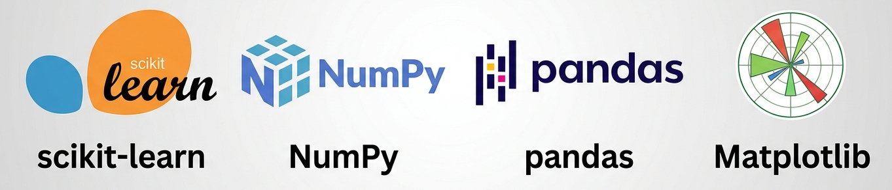

# Machine Learning with Scikit-learn

Welcome to my **Machine Learning** learning repository!

This repository documents my journey of learning Machine Learning using **Python** and **Scikit-learn**. It contains implementations of fundamental machine learning algorithms, hands-on experiments, model comparisons, and practical examples.

---

##  About This Repository

The goal of this repository is to:

- Learn Machine Learning concepts from scratch.
- Implement algorithms using Scikit-learn.
- Understand when and why to use each algorithm.
- Compare model performance on real-world datasets.
- Build a strong foundation for advanced AI and Deep Learning.

---

##  Technologies Used

- Python
- Scikit-learn
- NumPy
- Pandas
- Matplotlib
- Jupyter Notebook


---

##  Repository Contents

```text
Machine-Learning/
│
├── -Linear-Regression/
├── -Multiple-Linear-Regression/
├── -Logistic-Regression/
├── -KNN/
├── -SVM/
├── -Naive-Bayes/
├── -Decision-Tree/
├── -Random-Forest/
├── -KMeans-Clustering/
├── -DBSCAN/
├── -Bagging/
├── -AdaBoost/
├── -Gradient-Boosting/
├── images/
└── README.md
```


